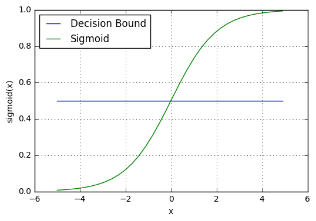
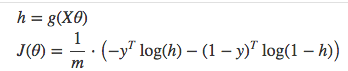
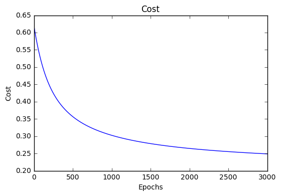
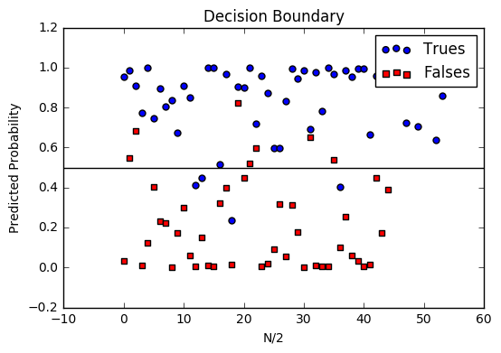

# Logistic Regression

## Introduction


Logistic regression is a classification algorithm used to assign observations to a discrete set of classes. Unlike linear regression which outputs continuous number values, logistic regression transforms its output using the logistic sigmoid function to return a probability value which can then be mapped to two or more discrete classes.

In other words, Logistic Regression estimates the probability that an instance belongs to a particular class. If the estimated probability is > 50%, then the model predicts in positive otherwise in negative.

## Comparison to linear regression


Given data on time spent studying and exam scores. :doc:`linear_regression` and logistic regression can predict different things:

  - **Linear Regression** could help us predict the student's test score on a scale of 0 - 100. Linear regression predictions are continuous (numbers in a range).

  - **Logistic Regression** could help use predict whether the student passed or failed. Logistic regression predictions are discrete (only specific values or categories are allowed). We can also view probability scores underlying the model's classifications.

## Types of logistic regression

  - Binary (Pass/Fail)
  - Multi (Cats, Dogs, Sheep)
  - Ordinal (Low, Medium, High)


## Binary logistic regression

Say we're given <a href='http://scilab.io/wp-content/uploads/2016/07/data_classification.csv'>data</a> on student exam results and our goal is to predict whether a student will pass or fail based on number of hours slept and hours spent studying. We have two features (hours slept, hours studied) and two classes: passed (1) and failed (0).


| **Studied**  | **Slept**   | **Passed**  |
|:------------:|:-----------:|:-----------:|
| 4.85         | 9.63        | 1           |
| 8.62         | 3.23        | 0           |
| 5.43         | 8.23        | 1           |
| 9.21         | 6.34        | 0           |

Graphically we could represent our data with a scatter plot.

{style="display: block; margin: 0 auto" }

## Sigmoid activation

In order to map predicted values to probabilities, we use the :ref:`sigmoid <activation_sigmoid>` function. The function maps any real value into another value between 0 and 1. In machine learning, we use sigmoid to map predictions to probabilities.

### Math

$$
  S(z) = \frac{1} {1 + e^{-z}}
$$

!!! note

    - $s(z)$ = output between 0 and 1 (probability estimate)
    - $z$ = input to the function (your algorithm's prediction e.g. mx + b)
    - $e$ = base of natural log

### Graph

{style="display: block; margin: 0 auto" }


### Code

```py title='sigmoid.py'
import numpy as np

def sigmoid(z):
    return 1.0 / (1 + np.exp(-z))
```


## Decision boundary

Our current prediction function returns a probability score between 0 and 1. In order to map this to a discrete class (true/false, cat/dog), we select a threshold value or tipping point above which we will classify values into class 1 and below which we classify values into class 2.

$$
  p \geq 0.5, class=1
$$

$$
  p < 0.5, class=0
$$

For example, if our threshold was 0.5 and our prediction function returned 0.7, we would classify this observation as positive. If our prediction was 0.2 we would classify the observation as negative. For logistic regression with multiple classes we could select the class with the highest predicted probability.

{style="display: block; margin: 0 auto" }


## Making predictions

Using our knowledge of sigmoid functions and decision boundaries, we can now write a prediction function. A prediction function in logistic regression returns the probability of our observation being positive, True, or "Yes". We call this class 1 and its notation is $P(class=1)$. As the probability gets closer to 1, our model is more confident that the observation is in class 1.

### Math

Let's use the same :ref:`multiple linear regression <multiple_linear_regression_predict>` equation from our linear regression tutorial.

$$
  z = W_0 + W_1\cdot Studied + W_2\cdot Slept
$$

This time however we will transform the output using the sigmoid function to return a probability value between 0 and 1.

$$
  P(class=1) = \frac{1} {1 + e^{-z}}
$$

If the model returns 0.4 it believes there is only a 40% chance of passing. If our decision boundary was 0.5, we would categorize this observation as "Fail.""

### Code

We wrap the sigmoid function over the same prediction function we used in :ref:`multiple linear regression <multiple_linear_regression_predict>`

```py title='predict.py'
import numpy
from sigmoid import sigmoid

def predict(features, weights):
    '''
    Returns 1D array of probabilities
    that the class label == 1
    '''
    z = np.dot(features, weights)
    return sigmoid(z)
```

## Cost function

Unfortunately we can't (or at least shouldn't) use the same cost function :ref:`mse` as we did for linear regression. Why? There is a great math explanation in chapter 3 of Michael Neilson's deep learning book [^5], but for now I'll simply say it's because our prediction function is non-linear (due to sigmoid transform). Squaring this prediction as we do in MSE results in a non-convex function with many local minimums. If our cost function has many local minimums, gradient descent may not find the optimal global minimum.

### Math

Instead of Mean Squared Error, we use a cost function called :ref:`loss_cross_entropy`, also known as Log Loss. Cross-entropy loss can be divided into two separate cost functions: one for $y=1$ and one for $y=0$.

{style="display: block; margin: 0 auto" }


The benefits of taking the logarithm reveal themselves when you look at the cost function graphs for y=1 and y=0. These smooth monotonic functions [^7] (always increasing or always decreasing) make it easy to calculate the gradient and minimize cost.

<figure markdown>
{style="display: block; margin: 0 auto" }
<figcaption>Image from Andrew Ng's slides on logistic regression</figcaption>
</figure>

The key thing to note is the cost function penalizes confident and wrong predictions more than it rewards confident and right predictions! The corollary is increasing prediction accuracy (closer to 0 or 1) has diminishing returns on reducing cost due to the logistic nature of our cost function.

### Above functions compressed into one

{style="display: block; margin: 0 auto" }

Multiplying by $y$ and $(1-y)$ in the above equation is a sneaky trick that let's us use the same equation to solve for both y=1 and y=0 cases. If y=0, the first side cancels out. If y=1, the second side cancels out. In both cases we only perform the operation we need to perform.

### Vectorized cost function

{style="display: block; margin: 0 auto" }

### Code

```py title='cost_function.py'
def cost_function(features, labels, weights):
    '''
    Using Mean Absolute Error

    Features:(100,3)
    Labels: (100,1)
    Weights:(3,1)
    Returns 1D matrix of predictions
    Cost = (labels*log(predictions) + (1-labels)*log(1-predictions) ) / len(labels)
    '''
    observations = len(labels)

    predictions = predict(features, weights)

    #Take the error when label=1
    class1_cost = -labels*np.log(predictions)

    #Take the error when label=0
    class2_cost = (1-labels)*np.log(1-predictions)

    #Take the sum of both costs
    cost = class1_cost - class2_cost

    #Take the average cost
    cost = cost.sum() / observations

    return cost
```


## Gradient descent

To minimize our cost, we use :doc:`gradient_descent` just like before in :doc:`linear_regression`. There are other more sophisticated optimization algorithms out there such as conjugate gradient like :ref:`optimizers_lbfgs`, but you don't have to worry about these. Machine learning libraries like Scikit-learn hide their implementations so you can focus on more interesting things!

### Math

One of the neat properties of the sigmoid function is its derivative is easy to calculate. If you're curious, there is a good walk-through derivation on stack overflow [^6]. Michael Neilson also covers the topic in chapter 3 of his book.

$$
  \begin{align}
  s'(z) & = s(z)(1 - s(z))
  \end{align}
$$

Which leads to an equally beautiful and convenient cost function derivative:

$$
  C' = x(s(z) - y)
$$

!!! note

    - $C'$ is the derivative of cost with respect to weights
    - $y$ is the actual class label (0 or 1)
    - $s(z)$ is your model's prediction
    - $x$ is your feature or feature vector.

Notice how this gradient is the same as the :ref:`mse` gradient, the only difference is the hypothesis function.

#### Pseudocode

```

   Repeat {

    1. Calculate gradient average
    2. Multiply by learning rate
    3. Subtract from weights

   }
```

### Code


```py title='update_weights.py'
def update_weights(features, labels, weights, lr):
    '''
    Vectorized Gradient Descent

    Features:(200, 3)
    Labels: (200, 1)
    Weights:(3, 1)
    '''
    N = len(features)

    #1 - Get Predictions
    predictions = predict(features, weights)

    #2 Transpose features from (200, 3) to (3, 200)
    # So we can multiply w the (200,1)  cost matrix.
    # Returns a (3,1) matrix holding 3 partial derivatives --
    # one for each feature -- representing the aggregate
    # slope of the cost function across all observations
    gradient = np.dot(features.T,  predictions - labels)

    #3 Take the average cost derivative for each feature
    gradient /= N

    #4 - Multiply the gradient by our learning rate
    gradient *= lr

    #5 - Subtract from our weights to minimize cost
    weights -= gradient

    return weights
```


## Mapping probabilities to classes

The final step is assign class labels (0 or 1) to our predicted probabilities.

### Decision boundary

```py title="decision_boundary.py"
def decision_boundary(prob):
  return 1 if prob >= .5 else 0    
```

### Convert probabilities to classes


```py title="classify.py"
def classify(predictions):
  '''
  input  - N element array of predictions between 0 and 1
  output - N element array of 0s (False) and 1s (True)
  '''
  decision_boundary = np.vectorize(decision_boundary)
  return decision_boundary(predictions).flatten()   
```

### Example output

```

   Probabilities = [ 0.967, 0.448, 0.015, 0.780, 0.978, 0.004]
   Classifications = [1, 0, 0, 1, 1, 0]
```

## Training


Our training code is the same as we used for :ref:`linear regression <simple_linear_regression_training>`.

```py title="train.py"
def train(features, labels, weights, lr, iters):
    cost_history = []

    for i in range(iters):
        weights = update_weights(features, labels, weights, lr)

        #Calculate error for auditing purposes
        cost = cost_function(features, labels, weights)
        cost_history.append(cost)

        # Log Progress
        if i % 1000 == 0:
            print "iter: "+str(i) + " cost: "+str(cost)

    return weights, cost_history  
```


## Model evaluation

If our model is working, we should see our cost decrease after every iteration.

```

   iter: 0 cost: 0.635
   iter: 1000 cost: 0.302
   iter: 2000 cost: 0.264
``` 
**Final cost:**  0.2487.  **Final weights:** [-8.197, .921, .738]

### Cost history

{style="display: block; margin: 0 auto" }

### Accuracy

:ref:`Accuracy <glossary_accuracy>` measures how correct our predictions were. In this case we simply compare predicted labels to true labels and divide by the total.

```py title="accuracy.py"
def accuracy(predicted_labels, actual_labels):
    diff = predicted_labels - actual_labels
    return 1.0 - (float(np.count_nonzero(diff)) / len(diff)) 
```


### Decision boundary

Another helpful technique is to plot the decision boundary on top of our predictions to see how our labels compare to the actual labels. This involves plotting our predicted probabilities and coloring them with their true labels.

{style="display: block; margin: 0 auto" }


### Code to plot the decision boundary


```py title="plot_decision_boundary.py"
def plot_decision_boundary(trues, falses):
    fig = plt.figure()
    ax = fig.add_subplot(111)

    no_of_preds = len(trues) + len(falses)

    ax.scatter([i for i in range(len(trues))], trues, s=25, c='b', marker="o", label='Trues')
    ax.scatter([i for i in range(len(falses))], falses, s=25, c='r', marker="s", label='Falses')

    plt.legend(loc='upper right');
    ax.set_title("Decision Boundary")
    ax.set_xlabel('N/2')
    ax.set_ylabel('Predicted Probability')
    plt.axhline(.5, color='black')
    plt.show()
```


## Multiclass logistic regression

Instead of $y = {0,1}$ we will expand our definition so that $y = {0,1...n}$. Basically we re-run binary classification multiple times, once for each class.

### Procedure

  1. Divide the problem into n+1 binary classification problems (+1 because the index starts at 0?).
  2. For each class...
  3. Predict the probability the observations are in that single class.
  4. prediction = $max(\text{probability of the classes})$

For each sub-problem, we select one class (YES) and lump all the others into a second class (NO). Then we take the class with the highest predicted value.


## Softmax activation

The softmax function (softargmax or normalized exponential function) is a function that takes as input a vector of K real numbers, and normalizes it into a probability distribution consisting of K probabilities proportional to the exponentials of the input numbers. That is, prior to applying softmax, some vector components could be negative, or greater than one; and might not sum to 1; but after applying softmax, each component will be in the interval [ 0 , 1 ] , and the components will add up to 1, so that they can be interpreted as probabilities.
The standard (unit) softmax function is defined by the formula 

$$
  \begin{align}
   σ(z_i) = \frac{e^{z_{(i)}}}{\sum_{j=1}^K e^{z_{(j)}}}\ \ \ for\ i=1,.,.,.,K\ and\ z=z_1,.,.,.,z_K
  \end{align}
$$

In words: we apply the standard exponential function to each element $z_i$ of the input vector $z$ and normalize these values by dividing by the sum of all these exponentials; this normalization ensures that the sum of the components of the output vector $σ(z)$ is 1. [^9]


## Scikit-Learn example

Let's compare our performance to the LogisticRegression model provided by scikit-learn [^8].

```py title=".browserslistrc"
--8<-- "docs/.code/logistic_regression_scipy.py"
```


**Scikit score:**  0.88. **Our score:** 0.89


## References

[^1]: http://www.holehouse.org/mlclass/06_Logistic_Regression.html
[^2]: http://machinelearningmastery.com/logistic-regression-tutorial-for-machine-learning
[^3]: https://scilab.io/machine-learning-logistic-regression-tutorial/
[^4]: https://github.com/perborgen/LogisticRegression/blob/master/logistic.py
[^5]: http://neuralnetworksanddeeplearning.com/chap3.html
[^6]: http://math.stackexchange.com/questions/78575/derivative-of-sigmoid-function-sigma-x-frac11e-x
[^7]: https://en.wikipedia.org/wiki/Monotoniconotonic_function
[^8]: http://scikit-learn.org/stable/modules/linear_model.html#logistic-regression>
[^9]: https://en.wikipedia.org/wiki/Softmax_function
